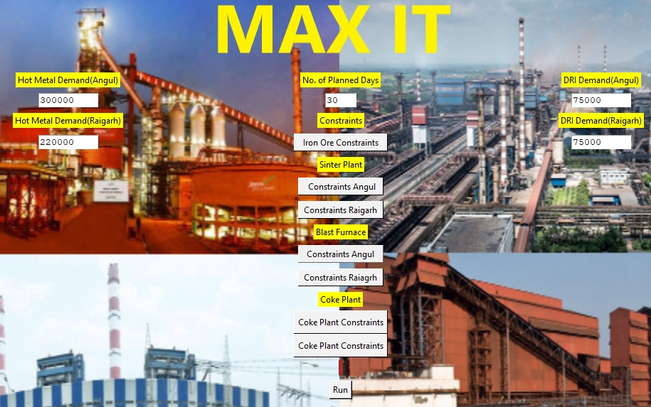

# Procurement-Optimization

Procurement based contribution optimization models for a leading steel manufacturer in the country.

Libraries used: Pulp(Linear Programming), Tkinter(User Interface), Pandas, Numpy

Amateur Interface:

